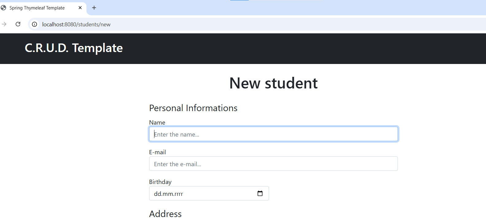
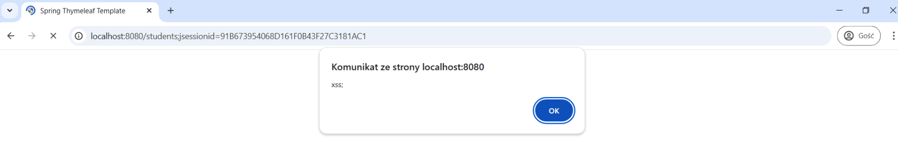
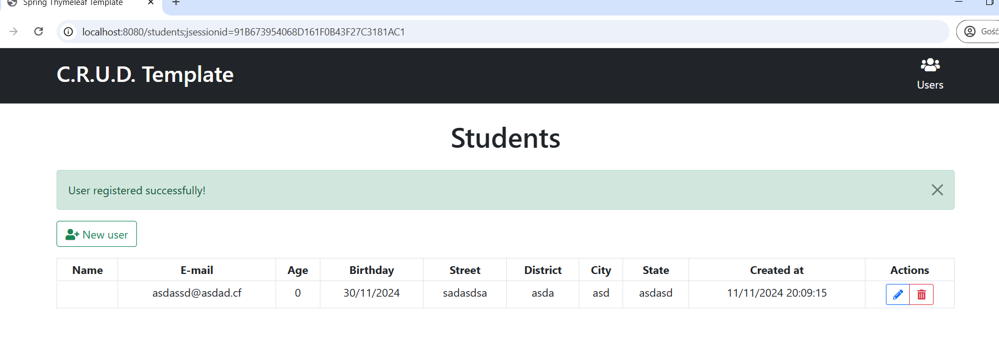
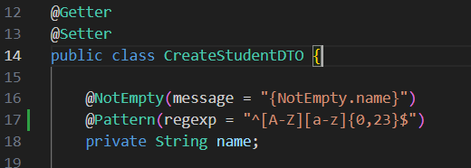

# XSS

Zidentyfikowano podatność persistent (stored) XSS w aplikacji Java. Podatność polega na braku walidacji danych wejściowych dzięki czemu możemy zapisać na serwerze przykładowy kod js.

pierwszy krok: utworzenie nowego usera

drugi krok: w polu name zameiszczony przykładowy skrypt js: ``. Po zapisaniu usera, skrypt zostaje wykonany przez przeglądarkę:

Dane zapisanego użytkownika możemy zobaczyć tutaj:

Widać że zapisany kod w polu `name` nie jest walidowany co pozwala na wstrzyknięcie tam złośliwego kodu.

Przykładem rowziązania problemu jest wykorzystanie adnotacji z biblioteki `javax.validation.constraints`, pozwalającej na sprawdzenie ze wzorcem regex, w tym przypadku czy w pole imie zawiera tylko (max23) znaki A-z 

